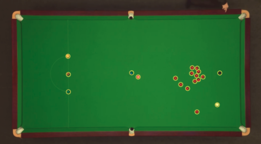
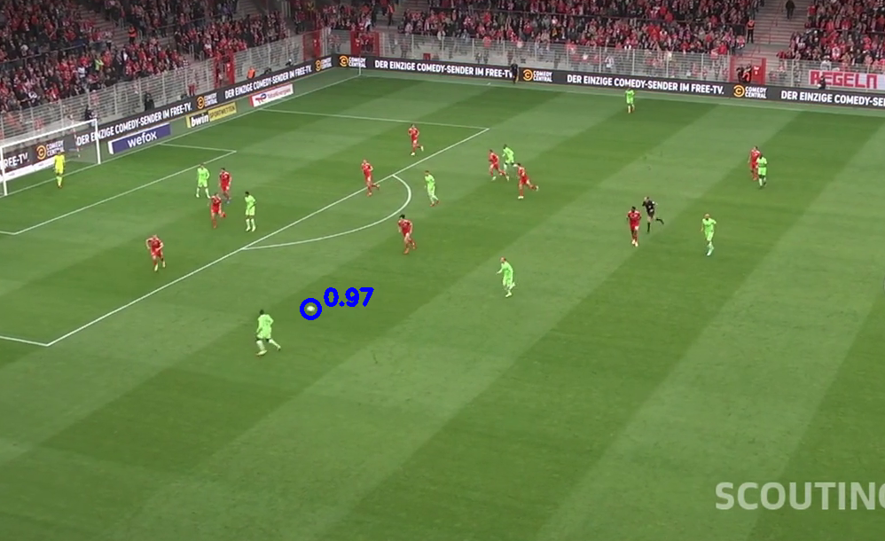

# A simplified Centernet for small object detection

CenterNet is a neural network for object detection that can detect multiple objects from multiple classes in an image, by providing bounding boxes. It is based on heatmaps where we simultaneously predict a rough estimate of each objects center, that we refine with an offset along x and y, and where bounding boxes dimensions are regressed too.

Link to YouTube video : https://youtu.be/tHeADA5AeJM

See the CenterNet official repo : https://github.com/xingyizhou/CenterNet

## Current repository

In this repository, we assume that we want to detect small objects where bounding boxes regression is of minor importance. What we want is an accurate position of the objects like balls.

See the jupyter notebook to have full training pipeline.

<p>
<em>Snooker balls (multi-object detection)</em></br>

</p>

<p>
<em>Soccer ball (single object detection)</em></br>

</p>

## Network architecture

- Backbone : Resnet-18
- Heatmaps for location and offsets to correct quantization errors
- Loss: focal loss for main heatmap, and L1-loss for offsets
- Optimizer: lr = 1e-4 for 5 iterations, then 1e-5 for 5 iterations
- For easy object detection, like snooker/pool you can get a loss of < 0.25
- For more difficult tasks, like soccer you can get a loss of < 1.0

## Multiple object detections

```
python multi_object_detection.py pool_video.mp4 weights/pool.pth --conf 0.5
```

You will be able to fine tune the confidence threshold for your detections thanks to a slider.

## Single object detection & tracking

```
python track.py .soccer_video.mp4 weights/soccer.pth
```

Instead of performing detection only, we add some basic tracking filtering to avoid outliers in terms of localization.

## Data

I made my own annotation from the Kaggle DFL challenge https://www.kaggle.com/competitions/dfl-bundesliga-data-shootout

Same for snooker, I annotated images from https://www.youtube.com/watch?v=Q2rLBfckjGw&ab_channel=EurosportSnooker

Annotation was quite fast since you just need to pick a points instead of bounding boxes.

You can/should augment your dataset (flip horizontally/vertically, random translations) to improve performances.